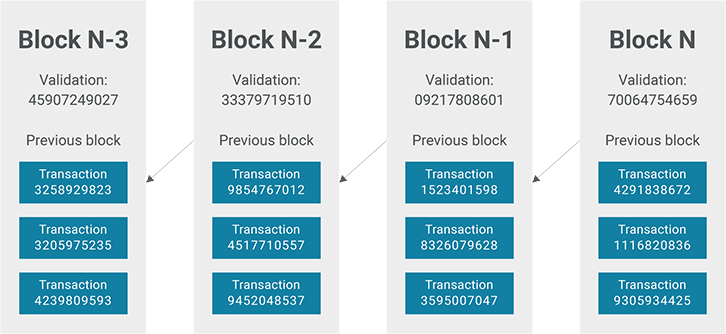
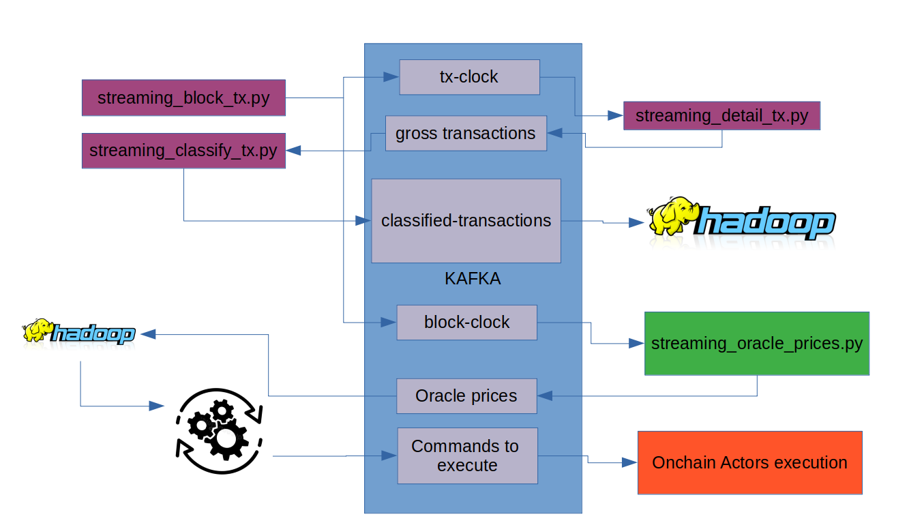

# Offchain Watchers Application

## 1 - Resumo

Offchain Watchers é um dos três componentes desenvolvidos para interagir com redes blockchain públicas através de software e explorar as oportunidades oferecidas por esta tecnologia. 

Este pacote em particular, na sua versão final, é uma imagem Docker que contém aplicações escritas em Python. Estas aplicações trabalham de forma integrada e se comunicam através de tópicos do Apache Kafka, com o objetivo de obter dados de transações realizadas em redes blockchain públicas, compatíveis com a EVM (Ethereum Virtual Machine), de maneira otimizada e escalável, para satisfazer o requisito de processar esses dados em tempo real com o mínimo de latência possível.

## 2 - Introdução

O pacote **Offchain Watchers** é composto por mini-aplicações escritas para trabalhar de forma integrada e obter dados brutos das transações efetuadas em determinadas redes e em tempo real. Um exemplo de [transação na rede principal Ethereum pode ser vista aqui](https://etherscan.io/tx/0x2d0f5e509165c64c755e1126e2b3671d80341f7f7f0a5b202a96a439839f69be).

### 2.1 - O que não é escopo dessa aplicação 

A obtenção de dados **on chain**, ou seja, por meio de interação com [contratos inteligentes](https://ethereum.org/en/developers/docs/smart-contracts/) não está no escopo desse pacote. Tais funcionalidades foram segregadas e se encontram no pacote publicado no [repositório Onchain Watchers](https://github.com/marcoaureliomenezes/onchain-watchers). Essa decisão possibitou a criação de uma imagem mais leve do pacote **Offchain-watchers**, o que será importante, a medida que para certas finalidades muitos containers serão lançados.

A interação com o protocolo, ou seja, execução de transações também não é escopo desse pacote. Algumas possibilidades interessantes de interação com contratos inteligentes estão implementadas no repositório [Onchain Actors],

### 2.2 - O que é escopo dessa aplicação

Partindo do pressuposto que essa aplicação consegue obter dados de transações efetuadas uma rede blockchain em tempo real e colocá-las em um tópico do kafka, ela torna possível a análise das transações e abre uma vasta gama de oportunidades de obtenção de conhecimento e insights para operar nesses protocolos, explorando contratos inteligentes como por exemplo aplicações no mundo [DEFI](https://www.infomoney.com.br/guias/defi/) e da [Web-3.0](https://www.infomoney.com.br/guias/web-3-0-e-criptoativos/) em geral. Também é possivel monitorar endereços específicos, acompanhar estratégias de outros usuários e aferir metricas sobre o protocolo em questão. 

### 2.3 - Como acessar dados de uma rede blockchain de forma escalável

A arquitetura desenvolvida para essa aplicação é muito semelhante a de microserviços e foi construída com intuito de otimizar (minimizar) as requisições feitas por rotinas da biblioteca **web3.py** a nós do provedor [Node as a service](https://cryptoapis.io/products/node-as-a-service). 

Em redes blockchain, todo histórico de transações efetuadas é replicado em todos os nós. Para executar ou ler uma transação o ponto de entrada deve ser também um nó da rede. Por esse motivo, para ler dados de uma rede P2P é necessário possuir acesso um nó na rede. Devido aos requisitos de hardware para deploy de um nó serem custosos, tanto financeiramente quanto tecnicamente, a primeira abordagem escolhida foi utilizar um provedor de Blockchain NaaS. Os principais provedores nesse ramo são [Infura](https://www.infura.io/) e [Alchemy](https://www.alchemy.com/), e por esse motivo ambos foram utilizados nessa aplicação.

### 2.4 - Overview sobre funcionamento de uma rede Blockchain

No desenvolvimento, 2 redes diferentes foram testadas:

* Goerli Ethereum Mainnet (Test network)
* Ethereum Mainnet

Por serem públicas, os dados das transações feitas nesses protocolos são públicos e podem ser acessados das seguintes formas:

* Acesso a um nó que faz parte da rede, ja que todos os nós de uma rede possuem uma cópia da cadeia de blocos.
* Serviços Web de escaneamento em tempo real dos protocolos, como por exemplo [etherscan](https://etherscan.io/) ou [goerli-etherscan](https://goerli.etherscan.io/).

No funcionamento de uma rede blockchain Layer 1 em um breve resumo, [blocos](https://ethereum.org/pt-br/developers/docs/blocks/) são publicados periodicamente na cadeia de blocos. Cada bloco contém transações efetuadas por usuários do protocolo e validadas pelo nó que minerou aquele bloco. A cadeia de blocos é imutável e transparente a todos os nós da rede. Qualquer nó pode verificar as transações contidas em blocos minerados.

Essas transações contém dados brutos com diferentes atributos que são bem úteis para inumeras aplicabilidades. Seguem alguns exemplos:

* Monitoramento de todas as transferências de um token nativo de uma rede blockchain, como por exemplo o ETH na rede Ethereum.

* Monitoramento de interações com todos os contratos inteligentes ja deployados na rede.

* Análise de contratos inteligentes recém deployados nas redes de teste e mainnets, podendo obter informações sobre aplicações desenvolvidas no protocolo.

* Análise das taxas de queima (burn) do token nativo, por meio de consumo de gas, e criação (mint), por meio de novos blocos minerados tirando insights sobre [tokenomics](https://academy.binance.com/en/articles/what-is-tokenomics-and-why-does-it-matter).

* Análise taxas cobradas para efetuar transações. 

## 3 - Arquitetura de Solução

Segue uma breve descrição sobre as tecnologias utilizadas para construção desse sistema de ingestão de dados com origem em blockchains.

### 3.1 - Docker

Como ja mencionado esse pacote é composto de 5 scripts python que quando executados concorrentemente comportam-se como JOBS que leem dados de uma blockchain usando a biblioteca web3.py e comunicando-se por meio de tópicos do Apache Kafka. Cada Job é executado dentro de um container docker instanciado a partir de uma [imagem offchain-watcher](https://hub.docker.com/repository/docker/marcoaureliomenezes/offchain-watcher/general) Isso traz benefícios para o sistema como escalabilidade e alta disponibilidade e portabilidade.

### 3.2 - Biblioteca Web3.py e a interação com provedores NaaS

Com o uso do pacote web3.py é possivel se conectar a blockchains usando uma url e o protocolo HTTP. Essa requisição é feita para um provedor NaaS. Porém é necessário criar uma conta e gerar uma chave (API KEY) para acesso ao serviço. Segue abaixo um exemplo de como instanciar um objeto web3 com acesso a um nó da rede principal **ethereum** utilizando do provedor infura.

    web3 = Web3(Web3.HTTPProvider(https://mainnet.infura.io/v3/{api_key}))

Cada API KEY, em seu plano gratuito, oferece os benefícios de 100k requests por dia e uma taxa máxima de 10 requests por segundo. Essa informação é um fator limitante para o objetivo dessa aplicação. Portanto torna-se necessária a implementação de uma arquitetura de solução que minimize o número de requests para obter os dados de transações efetuadas em tempo real.

### 3.3 - Apache Kafka

Na solução escolhida, os Jobs comunicam entre si com o uso do [Apache Kafka](https://kafka.apache.org/) O Kafka foi escolhido por suas características tais como:

*  Diferentes serviços poderem se comunicar utilizando como o [Kafka como um Backbone](https://www.confluent.io/blog/apache-kafka-for-service-architectures/).

* Atuar como ferramenta que integra sistemas e pode ser usada para ingestão de dados em diferentes ambientes, quando trabalha junto ao **Kafka Connect** por exemplo.

* Ser um broker de mensagens distribuído, o que também traz benefícios como escalabilidade e alta disponibilidade.

Segue abaixo uma representação da arquitetura de solução proposta para o sistema de ingestão de dados de redes blockchain.

A ilustração acima pode ser entendida como um sistema com diferentes partes que trabalhando junto e se comunicando via Kafka enviam os dados obtidos via web3.py api para o kafka.

### 3.4 - Workflow do sistema:

**1) batch_historical_txs.py:**: construído para obter dados históricos de transações em determinados endereços. É utilizado para obter por exemplo dados de todas as transações ja feitas com um contrato inteligente de DEFI tais como **Aave** e **Uniswap** enviar para um tópico kafka passado ao como parâmetro ao JOB. Esse módulo é independente, ou seja, não consome de nenhum outro tópico para executar suas ações.

**2) streaming_blocks_txs.py:** executa periodicamente e com uma frequência controlada. A cada execução ele carrega dados sobre o último bloco minerado no protocolo. Caso este bloco seja diferente do bloco carregado este é um novo bloco minerado. Nesse evento duas ações acontecem:

* Dados sobre o novo bloco minerado são enviados para o tópico **block-clock**.
* O ID de cada transação de um bloco minerado é enviado para o tópico **tx-clock**.

**3) streaming_detail_txs.py:** escuta o tópico **tx-clock** e para cada ID de transação recebido faz uma requisição ao nó e obtém detalhes sobre aquela transação e envia para o tópico **gross-txs**. Visto que cada requisição deve pussuir uma api key e, para o caso da rede principal ethereum cada bloco é publicado num intervalo médio de 8 segundos e contém em média 250 transações, esse JOB precisa executar de maneira escalável. A solução escolhida foi criar o tópico **tx-clock com N partições**. A partir disso **instanciar N jobs do tipo streaming_detail_txs** para consumirem cada um sua própria partição e api key. Isso torna possível fazer o balanceamento de requests para cada api key e garantir que o sistema será resiliente ao estouro de requisições diárias permitidas pelo provedor NaaS em suas políticas.

**4) streaming_classify_txs.py:** Escuta o tópico **gross-txs** e processa cada transação, a classificando das seguintes formas:

* Deploy de contrato inteligente (tópico deployed-contracts).
* Transferência de token nativo da rede entre endereços (tópico native-token-swap).
* Interação com contratos inteligentes (tópico contract-interaction).

**5) tx_input_converters.py:** Escuta o tópicos com informações de transações como por exemplo **contract-interaction** ou algum tópico criado pelo job **batch_historical_txs.py** e converte os dados do campo *input*, que representam as informações passadas para um contrato inteligente durante uma transação com o mesmo,.

## 4 - Detalhamento técnico dos módulos offchain Watchers

Nesta sessão é detalhado o funcionamento de cada um dos modulos da aplicação **offchain-watchers**.

### 5.1 batch_historical_txs.py module

### 5.2 streaming_blocks_txs.py module

**Métricas sobre consumo de requisições**: Aproximadamente 76000 requisições por dia quando a frequência de clock é de 1 segundo.

### 5.3 Streaming_detail_txs.py module

**Métricas sobre consumo de requisições**:

### 5.4 Streaming_classify_txs.py module

**Métricas sobre consumo de requisições**: Não faz novas requisições ao provedor NaaS.

### 5.5 tx_input_onverters.py module